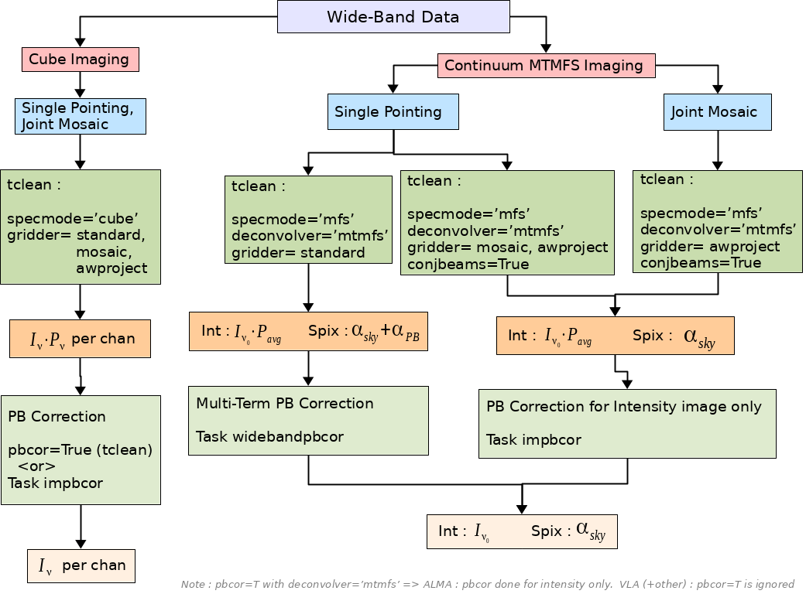

# Wide field and Wide band Imaging

This set of notebooks contains examples of wideband and widefield imaging along with numerical characterization to assess accuracy limits of the current CASA implementations. 

## Wideband Mosaic Imaging
Details TBD. Work is ongoing.  

## Wideband Primary Beam Correction

The chart below illustrates how to navigate the parameter space of cube and continuum imaging, 
single pointings and joint mosaics, and a choice of three gridding algorithms in CASA 6.0, for the purpose of
wideband primary beam correction. 
It lists relevant tclean settings, output image products, the primary beam correction step, and the final output image products.

### Examples

The Simulations directory contains examples of wideband primary beam correction for single pointings and mosaics using CASA 6.0.
The examples use a simulated multi-frequency VLA dataset with 1 point source and 2 offset pointings and demonstrate the CASA 
commands and outputs for various wideband primary beam correction options. Numerical differences between primary beam models and 
algorithm choices are also quantified via these examples. Only options and combinations that are known to work accurately in CASA 6.0 
are listed and demonstrated. 

### Linear Mosaics and Position-dependent PSFs.
It is possible to construct a wideband mosaic by following the single-pointing imaging route and performing a linear combination across
pointings at the end (separately on the restored Taylor coefficient images, prior to recomputing spectral index). However, experiments that 
compared 6 different ways of making wideband mosaics showed that this approach had the most significant errors in spectral index compared 
to the direct joint mosaic approach that produced the least errors. 

Further, if the instrument sampling function (uv-coverage, channel flagging, time observed per pointing) changes across the face of the mosaic, the PSF
computed at the center of the image will not be perfectly accurate for all sources in the joint mosaic. The effect is especially significant 
for spectral PSFs. There is therefore an argument towards working with fewer pointings (in the limit, one pointing at a time). 

Algorithm work is ongoing (pending) to figure out how best to reconcile the numerical gains of joint mosaics with the practical reality of
position dependence of instrumental parameters for wideband imaging where spatial and spectral structure is to be reconstructed. 

### Additional Documentation
Additional documentation on [Wideband Imaging](https://casa.nrao.edu/casadocs-devel/stable/imaging/synthesis-imaging/wide-band-imaging) and
[Widefield Imaging](https://casa.nrao.edu/casadocs-devel/stable/imaging/synthesis-imaging/wide-field-imaging-full-primary-beam) may be found
on [CASAdocs](https://casa.nrao.edu/casadocs-devel/stable).

